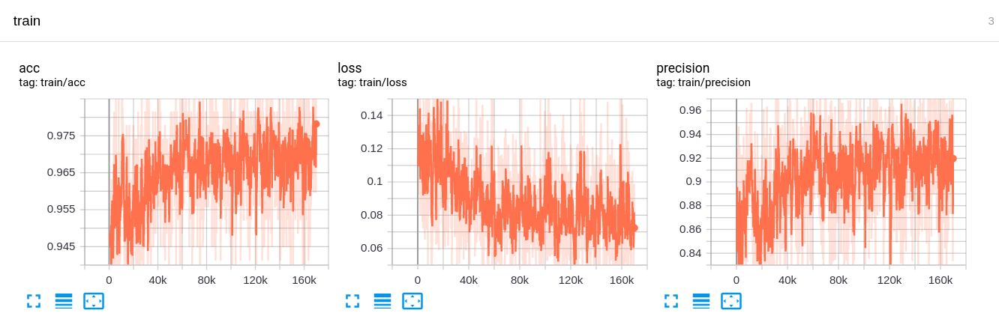
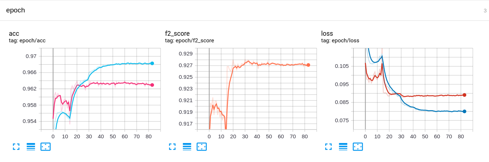
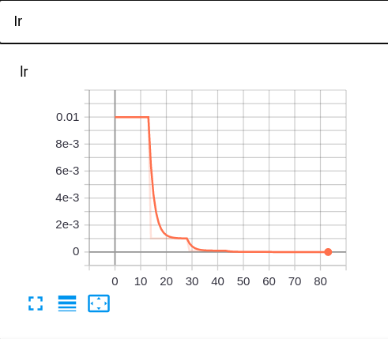

# Muliti_Lable_Classification_Planet
Try to use multi-label-classification realize Planet-Kaggle task


## Dataset

* <https://www.kaggle.com/c/planet-understanding-the-amazon-from-space/data>
* <https://www.kaggle.com/nikitarom/planets-dataset>


## Config

```shell script
vim ./configs/cfgs.py
```

## EDA

[Planet Dataset EDA](https://github.com/alexchungio/Multi-Lable-Classification-Planet/blob/main/docs/Planet_EDA.ipynb)

## Preprocess

### step1: Count dataset
```shell script
python ./tools/preprocess.py
```

###  step2: Get mean and std

```shell script
python ./tools/get_mean_std.py
```

## Train
```shell script
python ./train.py
```

* training
<p align=center>
  
</p>
* epoch
<p align=center>
  
</p>
* learning rate
<p align=center>
  
</p>

## Inference

```shell script
python ./inference.py
```

## Bag of Tricks

* Multi-fold cross-validation

* Re-Weighting strategy to alleviate the class-imbalance

* Get best threshold  with brute force search

* Stop when loss plateaus

* Image Augmentation

* ...

## TODO


## Reference 
* <https://github.com/rwightman/pytorch-planet-amazon>

